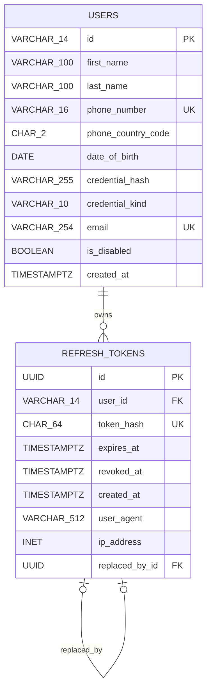

# AutoPharm Authentication ERD v1.1

Initial authentication schema containing users and rotating AutoDoc refresh tokens.

## AutoPharm Authentication ERD v1.1

A user may own multiple refresh tokens. A refresh token may be replaced by one newer token during rotation.

<!-- mermaid:id=v_auth_1_1 -->

