# AutoPharm Backend Architecture v1.0

Django modular-monolith repository structure and the dependency direction used inside each domain application.

## Backend repository structure and incremental app growth

The accounts app is the first implemented domain. Additional Django apps are added incrementally without reorganizing existing domains.

```mermaid
flowchart TB
  accTitle: Backend repository structure and incremental app growth
  accDescr: A hierarchy beginning at the backend directory. It contains Django configuration, the apps directory, shared code, integration tests, runtime entry points, dependency files, and environment configuration. The apps directory contains the current accounts app and three groups of future domain apps. The accounts app owns its models, migrations, API, services, security code, and tests.
  backend["backend/ - Django modular monolith"]
  class backend root
  config["config/ - settings, root URLs, ASGI, WSGI"]
  class config core
  apps["apps/ - feature-owned Django applications"]
  class apps core
  common["common/ - small genuinely shared primitives"]
  class common core
  integration_tests["tests/integration/ - cross-domain tests"]
  class integration_tests core
  runtime["manage.py and Dockerfile"]
  class runtime core
  dependencies["pyproject.toml and uv.lock"]
  class dependencies core
  environment[".env and .env.example"]
  class environment core
  accounts["accounts/ - CURRENT v1 authentication"]
  class accounts current
  account_models["models/ - User and RefreshToken"]
  class account_models currentDetail
  account_migrations["migrations/ - schema history"]
  class account_migrations currentDetail
  account_api["api/ - URLs, serializers, views"]
  class account_api currentDetail
  account_services["services/ - application use cases"]
  class account_services currentDetail
  account_security["security/ - access and refresh tokens"]
  class account_security currentDetail
  account_tests["tests/ - accounts-owned tests"]
  class account_tests currentDetail
  clinical_apps["FUTURE clinical apps - patients, clinicians, prescriptions"]
  class clinical_apps future
  commerce_apps["FUTURE commerce apps - catalogue, inventory, orders, payments, insurance"]
  class commerce_apps future
  operations_apps["FUTURE operations apps - dispensing, terminals, receipts, notifications, audit, integrations"]
  class operations_apps future
  backend ---|contains| config
  backend ---|contains| apps
  backend ---|contains| common
  backend ---|contains| integration_tests
  backend ---|contains| runtime
  backend ---|contains| dependencies
  backend ---|contains| environment
  apps -->|first increment| accounts
  accounts ---|owns| account_models
  accounts ---|owns| account_migrations
  accounts ---|owns| account_api
  accounts ---|owns| account_services
  accounts ---|owns| account_security
  accounts ---|owns| account_tests
  apps -.->|added incrementally| clinical_apps
  apps -.->|added incrementally| commerce_apps
  apps -.->|added incrementally| operations_apps
classDef root fill:#172554,stroke:#1d4ed8,color:#ffffff,stroke-width:2px
classDef core fill:#dbeafe,stroke:#2563eb,color:#172554
classDef current fill:#dcfce7,stroke:#15803d,color:#14532d,stroke-width:2px
classDef currentDetail fill:#f0fdf4,stroke:#22c55e,color:#14532d
classDef future fill:#f3f4f6,stroke:#6b7280,color:#374151,stroke-dasharray:5 5
%% portable-canonical-v2:eyJhY2Nlc3NpYmlsaXR5IjoiQSBoaWVyYXJjaHkgYmVnaW5uaW5nIGF0IHRoZSBiYWNrZW5kIGRpcmVjdG9yeS4gSXQgY29udGFpbnMgRGphbmdvIGNvbmZpZ3VyYXRpb24sIHRoZSBhcHBzIGRpcmVjdG9yeSwgc2hhcmVkIGNvZGUsIGludGVncmF0aW9uIHRlc3RzLCBydW50aW1lIGVudHJ5IHBvaW50cywgZGVwZW5kZW5jeSBmaWxlcywgYW5kIGVudmlyb25tZW50IGNvbmZpZ3VyYXRpb24uIFRoZSBhcHBzIGRpcmVjdG9yeSBjb250YWlucyB0aGUgY3VycmVudCBhY2NvdW50cyBhcHAgYW5kIHRocmVlIGdyb3VwcyBvZiBmdXR1cmUgZG9tYWluIGFwcHMuIFRoZSBhY2NvdW50cyBhcHAgb3ducyBpdHMgbW9kZWxzLCBtaWdyYXRpb25zLCBBUEksIHNlcnZpY2VzLCBzZWN1cml0eSBjb2RlLCBhbmQgdGVzdHMuIiwiZGF0YSI6eyJkaXJlY3Rpb24iOiJUQiIsImVkZ2VzIjpbeyJhcnJvdyI6Ii0tLSIsImZyb20iOiJiYWNrZW5kIiwibGFiZWwiOiJjb250YWlucyIsInRvIjoiY29uZmlnIn0seyJhcnJvdyI6Ii0tLSIsImZyb20iOiJiYWNrZW5kIiwibGFiZWwiOiJjb250YWlucyIsInRvIjoiYXBwcyJ9LHsiYXJyb3ciOiItLS0iLCJmcm9tIjoiYmFja2VuZCIsImxhYmVsIjoiY29udGFpbnMiLCJ0byI6ImNvbW1vbiJ9LHsiYXJyb3ciOiItLS0iLCJmcm9tIjoiYmFja2VuZCIsImxhYmVsIjoiY29udGFpbnMiLCJ0byI6ImludGVncmF0aW9uX3Rlc3RzIn0seyJhcnJvdyI6Ii0tLSIsImZyb20iOiJiYWNrZW5kIiwibGFiZWwiOiJjb250YWlucyIsInRvIjoicnVudGltZSJ9LHsiYXJyb3ciOiItLS0iLCJmcm9tIjoiYmFja2VuZCIsImxhYmVsIjoiY29udGFpbnMiLCJ0byI6ImRlcGVuZGVuY2llcyJ9LHsiYXJyb3ciOiItLS0iLCJmcm9tIjoiYmFja2VuZCIsImxhYmVsIjoiY29udGFpbnMiLCJ0byI6ImVudmlyb25tZW50In0seyJhcnJvdyI6Ii0tPiIsImZyb20iOiJhcHBzIiwibGFiZWwiOiJmaXJzdCBpbmNyZW1lbnQiLCJ0byI6ImFjY291bnRzIn0seyJhcnJvdyI6Ii0tLSIsImZyb20iOiJhY2NvdW50cyIsImxhYmVsIjoib3ducyIsInRvIjoiYWNjb3VudF9tb2RlbHMifSx7ImFycm93IjoiLS0tIiwiZnJvbSI6ImFjY291bnRzIiwibGFiZWwiOiJvd25zIiwidG8iOiJhY2NvdW50X21pZ3JhdGlvbnMifSx7ImFycm93IjoiLS0tIiwiZnJvbSI6ImFjY291bnRzIiwibGFiZWwiOiJvd25zIiwidG8iOiJhY2NvdW50X2FwaSJ9LHsiYXJyb3ciOiItLS0iLCJmcm9tIjoiYWNjb3VudHMiLCJsYWJlbCI6Im93bnMiLCJ0byI6ImFjY291bnRfc2VydmljZXMifSx7ImFycm93IjoiLS0tIiwiZnJvbSI6ImFjY291bnRzIiwibGFiZWwiOiJvd25zIiwidG8iOiJhY2NvdW50X3NlY3VyaXR5In0seyJhcnJvdyI6Ii0tLSIsImZyb20iOiJhY2NvdW50cyIsImxhYmVsIjoib3ducyIsInRvIjoiYWNjb3VudF90ZXN0cyJ9LHsiYXJyb3ciOiItLi0-IiwiZnJvbSI6ImFwcHMiLCJsYWJlbCI6ImFkZGVkIGluY3JlbWVudGFsbHkiLCJ0byI6ImNsaW5pY2FsX2FwcHMifSx7ImFycm93IjoiLS4tPiIsImZyb20iOiJhcHBzIiwibGFiZWwiOiJhZGRlZCBpbmNyZW1lbnRhbGx5IiwidG8iOiJjb21tZXJjZV9hcHBzIn0seyJhcnJvdyI6Ii0uLT4iLCJmcm9tIjoiYXBwcyIsImxhYmVsIjoiYWRkZWQgaW5jcmVtZW50YWxseSIsInRvIjoib3BlcmF0aW9uc19hcHBzIn1dLCJub2RlcyI6W3siY2xhc3MiOiJyb290IiwiaWQiOiJiYWNrZW5kIiwibGFiZWwiOiJiYWNrZW5kLyAtIERqYW5nbyBtb2R1bGFyIG1vbm9saXRoIn0seyJjbGFzcyI6ImNvcmUiLCJpZCI6ImNvbmZpZyIsImxhYmVsIjoiY29uZmlnLyAtIHNldHRpbmdzLCByb290IFVSTHMsIEFTR0ksIFdTR0kifSx7ImNsYXNzIjoiY29yZSIsImlkIjoiYXBwcyIsImxhYmVsIjoiYXBwcy8gLSBmZWF0dXJlLW93bmVkIERqYW5nbyBhcHBsaWNhdGlvbnMifSx7ImNsYXNzIjoiY29yZSIsImlkIjoiY29tbW9uIiwibGFiZWwiOiJjb21tb24vIC0gc21hbGwgZ2VudWluZWx5IHNoYXJlZCBwcmltaXRpdmVzIn0seyJjbGFzcyI6ImNvcmUiLCJpZCI6ImludGVncmF0aW9uX3Rlc3RzIiwibGFiZWwiOiJ0ZXN0cy9pbnRlZ3JhdGlvbi8gLSBjcm9zcy1kb21haW4gdGVzdHMifSx7ImNsYXNzIjoiY29yZSIsImlkIjoicnVudGltZSIsImxhYmVsIjoibWFuYWdlLnB5IGFuZCBEb2NrZXJmaWxlIn0seyJjbGFzcyI6ImNvcmUiLCJpZCI6ImRlcGVuZGVuY2llcyIsImxhYmVsIjoicHlwcm9qZWN0LnRvbWwgYW5kIHV2LmxvY2sifSx7ImNsYXNzIjoiY29yZSIsImlkIjoiZW52aXJvbm1lbnQiLCJsYWJlbCI6Ii5lbnYgYW5kIC5lbnYuZXhhbXBsZSJ9LHsiY2xhc3MiOiJjdXJyZW50IiwiaWQiOiJhY2NvdW50cyIsImxhYmVsIjoiYWNjb3VudHMvIC0gQ1VSUkVOVCB2MSBhdXRoZW50aWNhdGlvbiJ9LHsiY2xhc3MiOiJjdXJyZW50RGV0YWlsIiwiaWQiOiJhY2NvdW50X21vZGVscyIsImxhYmVsIjoibW9kZWxzLyAtIFVzZXIgYW5kIFJlZnJlc2hUb2tlbiJ9LHsiY2xhc3MiOiJjdXJyZW50RGV0YWlsIiwiaWQiOiJhY2NvdW50X21pZ3JhdGlvbnMiLCJsYWJlbCI6Im1pZ3JhdGlvbnMvIC0gc2NoZW1hIGhpc3RvcnkifSx7ImNsYXNzIjoiY3VycmVudERldGFpbCIsImlkIjoiYWNjb3VudF9hcGkiLCJsYWJlbCI6ImFwaS8gLSBVUkxzLCBzZXJpYWxpemVycywgdmlld3MifSx7ImNsYXNzIjoiY3VycmVudERldGFpbCIsImlkIjoiYWNjb3VudF9zZXJ2aWNlcyIsImxhYmVsIjoic2VydmljZXMvIC0gYXBwbGljYXRpb24gdXNlIGNhc2VzIn0seyJjbGFzcyI6ImN1cnJlbnREZXRhaWwiLCJpZCI6ImFjY291bnRfc2VjdXJpdHkiLCJsYWJlbCI6InNlY3VyaXR5LyAtIGFjY2VzcyBhbmQgcmVmcmVzaCB0b2tlbnMifSx7ImNsYXNzIjoiY3VycmVudERldGFpbCIsImlkIjoiYWNjb3VudF90ZXN0cyIsImxhYmVsIjoidGVzdHMvIC0gYWNjb3VudHMtb3duZWQgdGVzdHMifSx7ImNsYXNzIjoiZnV0dXJlIiwiaWQiOiJjbGluaWNhbF9hcHBzIiwibGFiZWwiOiJGVVRVUkUgY2xpbmljYWwgYXBwcyAtIHBhdGllbnRzLCBjbGluaWNpYW5zLCBwcmVzY3JpcHRpb25zIn0seyJjbGFzcyI6ImZ1dHVyZSIsImlkIjoiY29tbWVyY2VfYXBwcyIsImxhYmVsIjoiRlVUVVJFIGNvbW1lcmNlIGFwcHMgLSBjYXRhbG9ndWUsIGludmVudG9yeSwgb3JkZXJzLCBwYXltZW50cywgaW5zdXJhbmNlIn0seyJjbGFzcyI6ImZ1dHVyZSIsImlkIjoib3BlcmF0aW9uc19hcHBzIiwibGFiZWwiOiJGVVRVUkUgb3BlcmF0aW9ucyBhcHBzIC0gZGlzcGVuc2luZywgdGVybWluYWxzLCByZWNlaXB0cywgbm90aWZpY2F0aW9ucywgYXVkaXQsIGludGVncmF0aW9ucyJ9XX0sImRlc2NyaXB0aW9uIjoiVGhlIGFjY291bnRzIGFwcCBpcyB0aGUgZmlyc3QgaW1wbGVtZW50ZWQgZG9tYWluLiBBZGRpdGlvbmFsIERqYW5nbyBhcHBzIGFyZSBhZGRlZCBpbmNyZW1lbnRhbGx5IHdpdGhvdXQgcmVvcmdhbml6aW5nIGV4aXN0aW5nIGRvbWFpbnMuIiwiaWQiOiJiYWNrZW5kX3JlcG9zaXRvcnlfc3RydWN0dXJlIiwia2luZCI6ImZsb3djaGFydCIsInNvdXJjZVNoYTI1NiI6ImJiNjQ5MzY5OTkxODhkOTIyM2RjZjBmODVkOWVkOWM2OGMzM2ZkZDE1YWU0ZTk0MmY2ODA3MzgyYjg0M2E5NmEiLCJzdHlsZXMiOlt7ImRlZmluaXRpb24iOiJmaWxsOiMxNzI1NTQsc3Ryb2tlOiMxZDRlZDgsY29sb3I6I2ZmZmZmZixzdHJva2Utd2lkdGg6MnB4IiwibmFtZSI6InJvb3QifSx7ImRlZmluaXRpb24iOiJmaWxsOiNkYmVhZmUsc3Ryb2tlOiMyNTYzZWIsY29sb3I6IzE3MjU1NCIsIm5hbWUiOiJjb3JlIn0seyJkZWZpbml0aW9uIjoiZmlsbDojZGNmY2U3LHN0cm9rZTojMTU4MDNkLGNvbG9yOiMxNDUzMmQsc3Ryb2tlLXdpZHRoOjJweCIsIm5hbWUiOiJjdXJyZW50In0seyJkZWZpbml0aW9uIjoiZmlsbDojZjBmZGY0LHN0cm9rZTojMjJjNTVlLGNvbG9yOiMxNDUzMmQiLCJuYW1lIjoiY3VycmVudERldGFpbCJ9LHsiZGVmaW5pdGlvbiI6ImZpbGw6I2YzZjRmNixzdHJva2U6IzZiNzI4MCxjb2xvcjojMzc0MTUxLHN0cm9rZS1kYXNoYXJyYXk6NSA1IiwibmFtZSI6ImZ1dHVyZSJ9XSwidGl0bGUiOiJCYWNrZW5kIHJlcG9zaXRvcnkgc3RydWN0dXJlIGFuZCBpbmNyZW1lbnRhbCBhcHAgZ3Jvd3RoIiwidmVyc2lvbiI6MX0
```

<!-- mermaid:id=backend_repository_structure -->

## Dependency direction inside every domain app

Each app repeats the same small structure. HTTP concerns stay at the API edge, business workflows live in services, and persistence stays in Django models and querysets.

```mermaid
flowchart LR
  accTitle: Dependency direction inside every domain app
  accDescr: A left-to-right dependency flow from API URLs, serializers, and views to application services, then Django models and querysets, and finally PostgreSQL. Security policies and future external adapter interfaces are called by application services. App-owned tests verify the API, services, models, and security components.
  api["API - URLs, serializers, thin views"]
  class api apiLayer
  services["Services - named business use cases and transactions"]
  class services serviceLayer
  models["Models and querysets - persistence and constraints"]
  class models modelLayer
  postgres["PostgreSQL"]
  class postgres database
  security["Security policies - hashing and tokens"]
  class security support
  adapters["Future external adapters - SMS, email, payment, hardware"]
  class adapters future
  tests["App-owned tests"]
  class tests tests
  api -->|calls| services
  services -->|uses| models
  models -->|Django ORM| postgres
  services -->|applies| security
  services -.->|depends on interfaces| adapters
  tests -.->|verifies| api
  tests -.->|verifies| services
  tests -.->|verifies| models
  tests -.->|verifies| security
classDef apiLayer fill:#e0f2fe,stroke:#0284c7,color:#0c4a6e
classDef serviceLayer fill:#ede9fe,stroke:#7c3aed,color:#4c1d95,stroke-width:2px
classDef modelLayer fill:#fef3c7,stroke:#d97706,color:#78350f
classDef database fill:#172554,stroke:#1d4ed8,color:#ffffff,stroke-width:2px
classDef support fill:#fee2e2,stroke:#dc2626,color:#7f1d1d
classDef future fill:#f3f4f6,stroke:#6b7280,color:#374151,stroke-dasharray:5 5
classDef tests fill:#dcfce7,stroke:#16a34a,color:#14532d
%% portable-canonical-v2:eyJhY2Nlc3NpYmlsaXR5IjoiQSBsZWZ0LXRvLXJpZ2h0IGRlcGVuZGVuY3kgZmxvdyBmcm9tIEFQSSBVUkxzLCBzZXJpYWxpemVycywgYW5kIHZpZXdzIHRvIGFwcGxpY2F0aW9uIHNlcnZpY2VzLCB0aGVuIERqYW5nbyBtb2RlbHMgYW5kIHF1ZXJ5c2V0cywgYW5kIGZpbmFsbHkgUG9zdGdyZVNRTC4gU2VjdXJpdHkgcG9saWNpZXMgYW5kIGZ1dHVyZSBleHRlcm5hbCBhZGFwdGVyIGludGVyZmFjZXMgYXJlIGNhbGxlZCBieSBhcHBsaWNhdGlvbiBzZXJ2aWNlcy4gQXBwLW93bmVkIHRlc3RzIHZlcmlmeSB0aGUgQVBJLCBzZXJ2aWNlcywgbW9kZWxzLCBhbmQgc2VjdXJpdHkgY29tcG9uZW50cy4iLCJkYXRhIjp7ImRpcmVjdGlvbiI6IkxSIiwiZWRnZXMiOlt7ImFycm93IjoiLS0-IiwiZnJvbSI6ImFwaSIsImxhYmVsIjoiY2FsbHMiLCJ0byI6InNlcnZpY2VzIn0seyJhcnJvdyI6Ii0tPiIsImZyb20iOiJzZXJ2aWNlcyIsImxhYmVsIjoidXNlcyIsInRvIjoibW9kZWxzIn0seyJhcnJvdyI6Ii0tPiIsImZyb20iOiJtb2RlbHMiLCJsYWJlbCI6IkRqYW5nbyBPUk0iLCJ0byI6InBvc3RncmVzIn0seyJhcnJvdyI6Ii0tPiIsImZyb20iOiJzZXJ2aWNlcyIsImxhYmVsIjoiYXBwbGllcyIsInRvIjoic2VjdXJpdHkifSx7ImFycm93IjoiLS4tPiIsImZyb20iOiJzZXJ2aWNlcyIsImxhYmVsIjoiZGVwZW5kcyBvbiBpbnRlcmZhY2VzIiwidG8iOiJhZGFwdGVycyJ9LHsiYXJyb3ciOiItLi0-IiwiZnJvbSI6InRlc3RzIiwibGFiZWwiOiJ2ZXJpZmllcyIsInRvIjoiYXBpIn0seyJhcnJvdyI6Ii0uLT4iLCJmcm9tIjoidGVzdHMiLCJsYWJlbCI6InZlcmlmaWVzIiwidG8iOiJzZXJ2aWNlcyJ9LHsiYXJyb3ciOiItLi0-IiwiZnJvbSI6InRlc3RzIiwibGFiZWwiOiJ2ZXJpZmllcyIsInRvIjoibW9kZWxzIn0seyJhcnJvdyI6Ii0uLT4iLCJmcm9tIjoidGVzdHMiLCJsYWJlbCI6InZlcmlmaWVzIiwidG8iOiJzZWN1cml0eSJ9XSwibm9kZXMiOlt7ImNsYXNzIjoiYXBpTGF5ZXIiLCJpZCI6ImFwaSIsImxhYmVsIjoiQVBJIC0gVVJMcywgc2VyaWFsaXplcnMsIHRoaW4gdmlld3MifSx7ImNsYXNzIjoic2VydmljZUxheWVyIiwiaWQiOiJzZXJ2aWNlcyIsImxhYmVsIjoiU2VydmljZXMgLSBuYW1lZCBidXNpbmVzcyB1c2UgY2FzZXMgYW5kIHRyYW5zYWN0aW9ucyJ9LHsiY2xhc3MiOiJtb2RlbExheWVyIiwiaWQiOiJtb2RlbHMiLCJsYWJlbCI6Ik1vZGVscyBhbmQgcXVlcnlzZXRzIC0gcGVyc2lzdGVuY2UgYW5kIGNvbnN0cmFpbnRzIn0seyJjbGFzcyI6ImRhdGFiYXNlIiwiaWQiOiJwb3N0Z3JlcyIsImxhYmVsIjoiUG9zdGdyZVNRTCJ9LHsiY2xhc3MiOiJzdXBwb3J0IiwiaWQiOiJzZWN1cml0eSIsImxhYmVsIjoiU2VjdXJpdHkgcG9saWNpZXMgLSBoYXNoaW5nIGFuZCB0b2tlbnMifSx7ImNsYXNzIjoiZnV0dXJlIiwiaWQiOiJhZGFwdGVycyIsImxhYmVsIjoiRnV0dXJlIGV4dGVybmFsIGFkYXB0ZXJzIC0gU01TLCBlbWFpbCwgcGF5bWVudCwgaGFyZHdhcmUifSx7ImNsYXNzIjoidGVzdHMiLCJpZCI6InRlc3RzIiwibGFiZWwiOiJBcHAtb3duZWQgdGVzdHMifV19LCJkZXNjcmlwdGlvbiI6IkVhY2ggYXBwIHJlcGVhdHMgdGhlIHNhbWUgc21hbGwgc3RydWN0dXJlLiBIVFRQIGNvbmNlcm5zIHN0YXkgYXQgdGhlIEFQSSBlZGdlLCBidXNpbmVzcyB3b3JrZmxvd3MgbGl2ZSBpbiBzZXJ2aWNlcywgYW5kIHBlcnNpc3RlbmNlIHN0YXlzIGluIERqYW5nbyBtb2RlbHMgYW5kIHF1ZXJ5c2V0cy4iLCJpZCI6ImRvbWFpbl9hcHBfZGVwZW5kZW5jeV9kaXJlY3Rpb24iLCJraW5kIjoiZmxvd2NoYXJ0Iiwic291cmNlU2hhMjU2IjoiYzRhYTFkNGQxN2RhZTcwOTZhYzE1ZDliOGIyZDE3N2ZiNDIxODYwZGViY2IxYzNiMTU2ZjMwYjFjZWE1NTNjZiIsInN0eWxlcyI6W3siZGVmaW5pdGlvbiI6ImZpbGw6I2UwZjJmZSxzdHJva2U6IzAyODRjNyxjb2xvcjojMGM0YTZlIiwibmFtZSI6ImFwaUxheWVyIn0seyJkZWZpbml0aW9uIjoiZmlsbDojZWRlOWZlLHN0cm9rZTojN2MzYWVkLGNvbG9yOiM0YzFkOTUsc3Ryb2tlLXdpZHRoOjJweCIsIm5hbWUiOiJzZXJ2aWNlTGF5ZXIifSx7ImRlZmluaXRpb24iOiJmaWxsOiNmZWYzYzcsc3Ryb2tlOiNkOTc3MDYsY29sb3I6Izc4MzUwZiIsIm5hbWUiOiJtb2RlbExheWVyIn0seyJkZWZpbml0aW9uIjoiZmlsbDojMTcyNTU0LHN0cm9rZTojMWQ0ZWQ4LGNvbG9yOiNmZmZmZmYsc3Ryb2tlLXdpZHRoOjJweCIsIm5hbWUiOiJkYXRhYmFzZSJ9LHsiZGVmaW5pdGlvbiI6ImZpbGw6I2ZlZTJlMixzdHJva2U6I2RjMjYyNixjb2xvcjojN2YxZDFkIiwibmFtZSI6InN1cHBvcnQifSx7ImRlZmluaXRpb24iOiJmaWxsOiNmM2Y0ZjYsc3Ryb2tlOiM2YjcyODAsY29sb3I6IzM3NDE1MSxzdHJva2UtZGFzaGFycmF5OjUgNSIsIm5hbWUiOiJmdXR1cmUifSx7ImRlZmluaXRpb24iOiJmaWxsOiNkY2ZjZTcsc3Ryb2tlOiMxNmEzNGEsY29sb3I6IzE0NTMyZCIsIm5hbWUiOiJ0ZXN0cyJ9XSwidGl0bGUiOiJEZXBlbmRlbmN5IGRpcmVjdGlvbiBpbnNpZGUgZXZlcnkgZG9tYWluIGFwcCIsInZlcnNpb24iOjF9
```

<!-- mermaid:id=domain_app_dependency_direction -->

